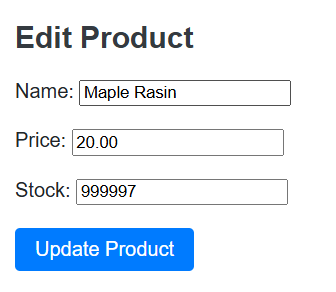
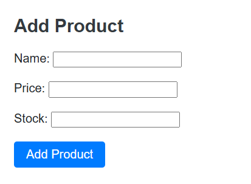
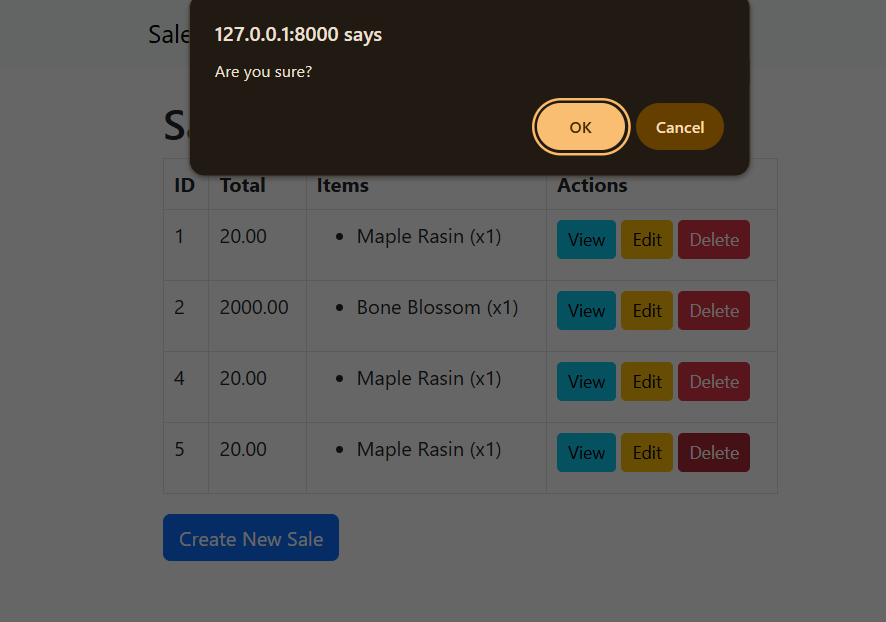

<p align="center">
    <a href="https://github.com/Janverly01492/Midterm/actions">
    </a>
    <a href="https://github.com/Janverly01492/Midterm">
</p>

---

# **Simple Inventory Management System**
##### Made by
Janverly Mhay O. Bacani

---

## Description / Overview
The **Simple Inventory Management System** is a web-based application developed as a midterm project requirement.  
It allows users to manage inventory records — adding, viewing, updating, and deleting items — through an intuitive interface.  
The project is built using **PHP (Laravel Framework)**, **MySQL**, **HTML**, **CSS**, and **JavaScript**.

This system demonstrates CRUD (Create, Read, Update, Delete) functionalities and applies fundamental web development concepts including database integration and server-side logic.

---

## Objectives
- Develop a working CRUD web application using Laravel and MySQL.  
- Apply MVC (Model-View-Controller) design principles.  
- Demonstrate data manipulation through forms and dynamic display.  
- Create a responsive and user-friendly interface.  
- Showcase practical skills in web programming and database management.

---

## Features / Functionality
- **Add Item** – Insert new inventory records into the system.  
- **Edit Item** – Update existing item details.  
- **Delete Item** – Remove records from the database.  
- **View List** – Display all inventory items with real-time data updates.  
- **Search Feature** – Quickly locate items by name or category.  
- **Dashboard** – Provides an overview of stock quantities and item counts.  

---

## Images

### Product Dashboard

Displays a list of all available products along with their price, stock, and actions to edit or delete an item.
It helps users easily monitor inventory and manage products efficiently.

.png)

### Edit Product 

Enables users to modify existing product details such as the name, price, or stock count.
This ensures that any updates or corrections to product data can be easily managed within the system.



### Add Product 

This page allows the user to add new products to the system by entering the product’s name, price, and available stock quantity.
It provides a simple and user-friendly form interface for quick data input.



###  Sales Confirmation Alert

This screenshot shows the **confirmation prompt** that appears when a user attempts to delete a sales record.  
The alert message `"Are you sure?"` ensures that users confirm their action before permanently deleting any data.  
This feature helps prevent accidental deletions and maintains data integrity within the sales management system.





---
## 🧩 Installation Instructions

1. **Clone the Repository**
   ```bash
   git clone https://github.com/Janverly01492/Midterm.git
   cd Midterm
2. **Install Defendencies**
    ```bash
    composer install
    npm install
    npm run dev
3. **Set Up Environment Variables**
   ```bash
   cp .env.example .env

Then update .env with local database credentials:
 ```bash
 DB_HOST=127.0.0.1
       DB_PORT=3306
       DB_DATABASE=midterm_db
       DB_USERNAME=root
       DB_PASSWORD=
```
4. **Generate Application Key**
   ```bash
   php artisan key:generate
5. **Run Migrations**
   ```bash
   php artisan migrate
6. **Serve the Application**
   ```bash
   php artisan serve

---
